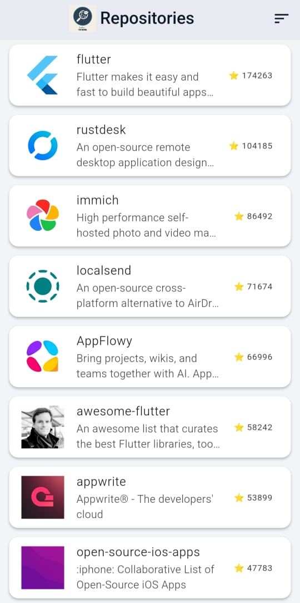
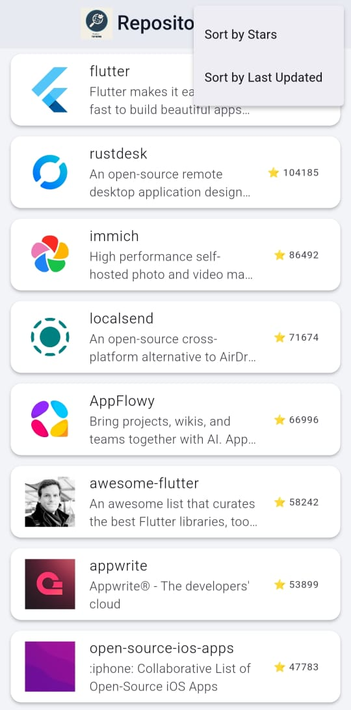
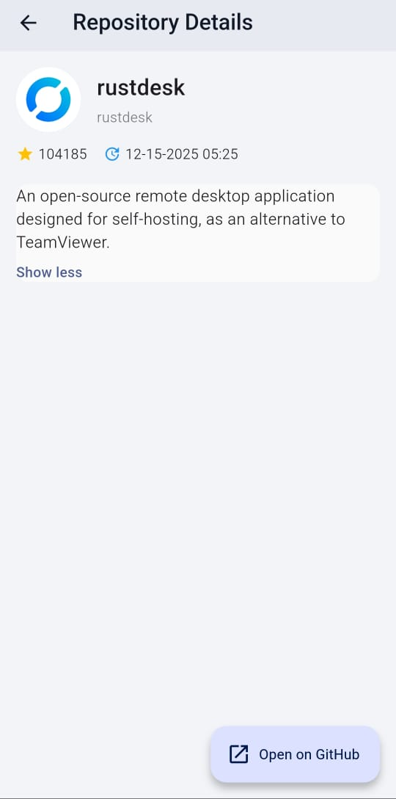

# GitHub Top Repos 

A Flutter application that searches GitHub for repositories using the keyword **"Flutter"** and displays the most popular repositories in a clean, professional UI with pagination, offline support, and dark/light themes.

---

##  Features

- Search GitHub repositories using the keyword **Flutter**
- Sort repositories by stars and update time
- Pagination with infinite scroll (loads more on scroll)
- Offline support using local caching
- Responsive and minimalist UI
- Repository details page with GitHub link
- Unit & widget tested architecture

---

## 🧱 Architecture

```
lib/
├── core/
│   ├── api/
│   ├── storage/
│   └── theme/
├── features/
│   └── repositories/
│       ├── controllers/
│       ├── models/
│       ├── services/
│       └── ui/
│           ├── pages/
│           └── widgets/
└── main.dart
```

### Key Technologies
- Flutter
- Riverpod (state management)
- Dio (networking)
- SharedPreferences (local cache)
- CachedNetworkImage
- Mocktail & flutter_test (testing)

---

## Testing & Reliability

This project includes **unit tests and widget tests** to ensure correctness and reliability.

### Covered areas:
- API service logic (mocked responses)
- Controller logic 
- UI widgets using Riverpod provider overrides

Run tests:
```bash
flutter test
```

All test files are located in the `/test` directory.

---

## 🌐 Offline Support

- First-page repository data is cached locally
- Cached data is displayed when the device is offline
- Pagination continues automatically when network is restored

---

## 🎨 UI & Theme

- Card-based list UI with smooth scrolling
- Expandable repository descriptions
- Direct GitHub link access

---

## 📸 Screenshots





---

## Getting Started

```bash
flutter pub get
flutter run
```

---

### 🧱 Architecture

The project follows a **layered modular architecture**:

- **Core Layer**: API services, local storage, theming, and shared utilities.
- **Features Layer**: Feature-specific modules like repositories, with their own models, services, controllers, and UI.
- **UI Layer**: Pages and widgets for rendering the interface, separated per feature.

This structure keeps code **scalable, maintainable, and testable**.


